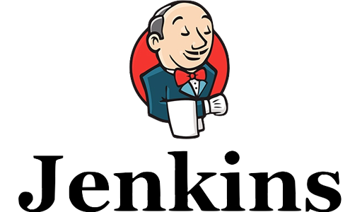
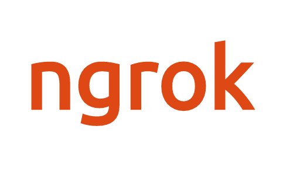
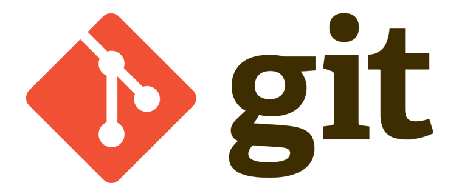
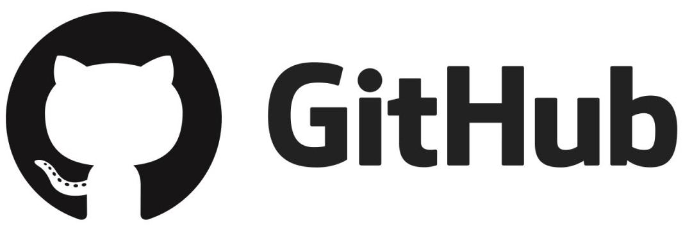
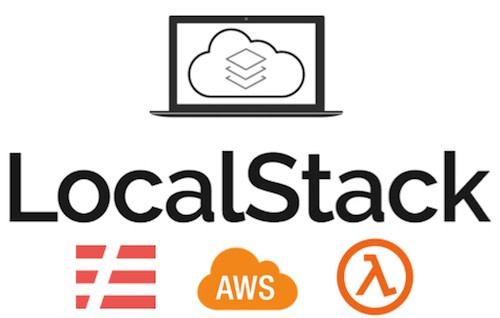

___
# Proyecto
___
### ¿Que es jenkins?
___

Jenkins es un servidor de integración continua, gratuito, open-source y actualmente uno de los más empleados para esta función. Además es muy fácil de utilizar.
La base de Jenkins son las tareas, donde indicamos qué es lo que hay que hacer en un build.
Pero la cosa no queda ahí. Una de las cosas buenas que tiene Jenkins es que además de poder ayudarte a integrar el código periódicamente, puede actuar como herramienta que sirva de enlace en todo el proceso de desarrollo.
Desde Jenkins podrás indicar que se lancen métricas de calidad y visualizar los resultados dentro de la misma herramienta. También podrás ver el resultado de los tests, generar y visualizar la documentación del proyecto o incluso pasar una versión estable del software al entorno de QA para ser probado, a pre-producción o producción.
___
### ¿Que es ngrok?
___

Ngrok es una herramienta que permite acceder a nuestro servidor local a cualquier persona en internet con la que compartamos una url generada dinamicamente , esto es muy útil por ejemplo cuando necesitamos mostrar avances constantemente en sitios que se encuentran en etapa de desarrollo o cuando trabajamos con un equipo de desarrolladores de forma remota.
___
### ¿Que es Terraform?
___

Terraform es una herramienta de orquestación de código abierto desarrollado por Hashicorp que nos permite definir nuestra infraestructura como código, esto quiere decir que es posible escribir en un fichero de texto la definición de nuestra infraestructura usando un lenguaje de programación declarativo y simple.
Terraform tiene soporte para una gran cantidad de proveedores de infraestructura local o en la nube, Amazon Web Services (AWS), Digital Ocean, Microsoft Azure, VMware vSphere, son ejemplos de proveedores de servicios.

- Algunas de los beneficios que tiene Terraform son:
- Administra infraestructuras considerablemente grandes o puede administrar una sola aplicación.
- Terraform no se limita a un proveedor en específico.
- Proporciona una sintaxis simple y unificada que permite administrar casi cualquier recurso en lugar de requerir que se utilicen herramientas independientes para cada plataforma y servicio.
- Las configuraciones que se realizan en Terraform puede ser compartida y re utilizable.
- El modelo de su centro de datos puede ser versionado, de esta forma es más sencillo observar el progreso de nuestro servicio y controlar los cambios.
___
### ¿Que es git?
___

Git es un software de control de versiones diseñado por Linus Torvalds, pensando en la eficiencia y la confiabilidad del mantenimiento de versiones de aplicaciones cuando éstas tienen un gran número de archivos de código fuente. Su propósito es llevar registro de los cambios en archivos de computadora y coordinar el trabajo que varias personas realizan sobre archivos compartidos.
___
### ¿Que es github?
___

GitHub es un sistema de gestión de proyectos y control de versiones de código, así como una plataforma de red social diseñada para desarrolladores. ¿Pero para qué se usa GitHub? Bueno, en general, permite trabajar en colaboración con otras personas de todo el mundo, planificar proyectos y realizar un seguimiento del trabajo.
___
### ¿Que es localstack?
___

Localstack es una librería de python que permite simular entornos cloud de aws, de esta forma podemos hacer pruebas localmente usando el cli de aws sin tener que llegar hasta una cuenta real y generar gastos.
___
### ¿Que es docker?
___

Docker es uno de los proyectos más conocidos y utilizados en temas de visualización. Lejos de ser un sistema operativo como tal, esta plataforma de código abierto hace uso de las funciones de aislamiento de recursos del kernel de Linux para poder dar lugar a contenedores independientes, dentro de los cuales se ejecutará una única aplicación con sus respectivas dependencias, pero funcionando siempre con un único kernel, el de la máquina real, en lugar de virtualizar uno por cada contenedor o máquina virtual.
___
